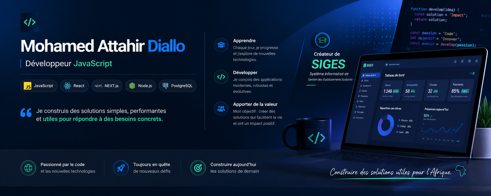

<!-- BANNIÈRE -->

  <p align="center">
  
</p>


<!-- ANIMATION DE TEXTE -->

<p align="center">
  
</p>

---

# 👋 Salut, moi c'est Mohamed Attahir Diallo

### 💻 Developer in progress • Codeloccol 🇳🇪

Je suis un développeur en formation, passionné par la création de solutions numériques utiles et concrètes.

J'apprends en construisant des projets, en expérimentant de nouvelles technologies et surtout en transformant mes idées en applications.

> **Learn. Build. Improve. Repeat. 🚀**

---

## 🛠️ Technologies & outils

### 🟢 Technologies que j'utilise régulièrement

<p>
  
</p>

### 🟡 Technologies que j'apprends actuellement

<p>
  
</p>

> 🌱 J'apprends principalement en construisant des projets et en mettant directement mes connaissances en pratique.

---

## 📊 GitHub Stats

<p align="center">
  
  
</p>

---

## 🌱 Currently Learning

* ⚛️ React & développement frontend
* ▲ Next.js
* 🔷 TypeScript
* 🟢 Node.js & Express.js
* 🗄️ MySQL & PostgreSQL
* 🔌 Conception et utilisation d'APIs
* 🧠 Approfondissement de JavaScript

---

## 🎯 Mes objectifs

* Approfondir mes bases en JavaScript
* Devenir progressivement autonome en développement frontend
* Comprendre réellement le développement backend
* Apprendre à concevoir et utiliser des APIs
* Améliorer mes compétences en bases de données
* Construire des applications utiles et maintenables
* Continuer à progresser à travers des projets concrets

---

## 📚 Ma façon d'apprendre

Je privilégie la pratique à la théorie.

**Apprendre → Construire → Se tromper → Comprendre → Améliorer**

Chaque erreur est une occasion de comprendre un peu mieux comment les choses fonctionnent.

---

## 💡 Ce qui m'intéresse

Je m'intéresse particulièrement aux projets qui permettent de résoudre des problèmes concrets grâce au numérique.

J'aime notamment explorer des idées autour de :

* 🌱 Agriculture & AgriTech
* 🎓 Éducation & gestion scolaire
* 📊 Outils de gestion
* 🌐 Applications web
* 🚀 Solutions numériques adaptées aux besoins locaux

---

## 📈 Ma progression

Je ne cherche pas à tout apprendre en même temps.

Mon objectif est de construire progressivement une base solide, puis d'aller vers des applications plus complexes.

```text
HTML / CSS       ████████████████████  Solide
JavaScript       ████████████████░░░░  En progression
React            ████████████░░░░░░░░  En apprentissage
Next.js          ██████████░░░░░░░░░░  En apprentissage
TypeScript       █████████░░░░░░░░░░░  En apprentissage
Backend          ████████░░░░░░░░░░░░  En progression
Bases de données ████████░░░░░░░░░░░░  En progression
```

---

## 📫 Me retrouver

<p align="left">
  <a href="https://github.com/DialloMoahamed">
    
  </a>
  <a href="https://www.codeloccol.org/">
    
  </a>
</p>

---

### ⚡ Une chose que j'ai apprise

> **Je ne cherche pas à tout maîtriser d'un coup.
> Je construis, je casse, je comprends, puis je recommence. 🚀**

<p align="center">
  
</p>
